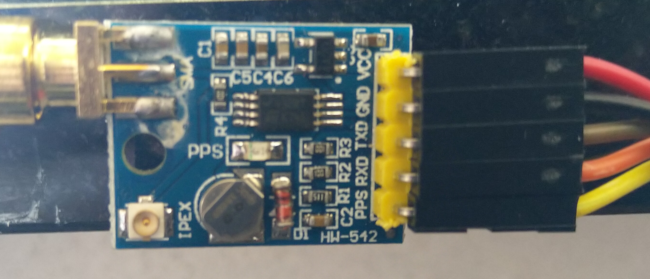
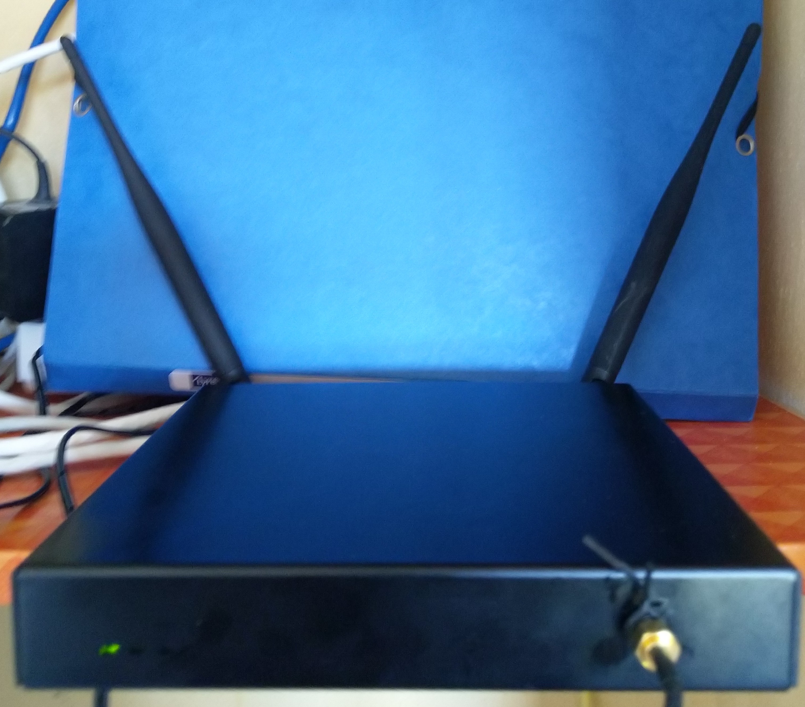

# DebFirewall
## Creates a Debian Based Firewall (Should work with Ubuntu too)

### Based on the work done by Joff Thyer of Blackhills Information Security: https://www.blackhillsinfosec.com/how-to-create-a-soho-router-using-ubuntu-linux/

Installs a complete SoHo firewall on Debian Buster or Stretch, with
 - BIND providing local name resolution.
 - ISC-DHCP-Server providing local DHCP
 - NTP resolves some of the systemd fu..ery regarding this + ensures that there's a current leapseconds file available

Optional* components:
 - DSHIELD logging: see https://isc.sans.edu/howto.html
 - Filebeat: forwarding the logs to Logstash for centralized log ingestion into Elasticsearch

 _*They install by default, modify the "main" routine accordingly._

The overall setup hardcoded in the script is:

| Connection | IP address     | NIC    |
| ---------- | -------------- | ------ | 
| Internet   | DHCP (ISP)     | enp1s0 |
| homenet1   | 192.168.10.1   | enp2s0 |
| homenet2   | 192.168.20.1   | enp3s0 |                                                
| homenet3   | 192.168.30.1   | enp4s0 |
| homenet4   | 192.168.40.1   | wlan0  |

If you need to change this, you'll have to search and replace as required for your specific environment.

For more information, have a look at my blogpost on this: https://blog.infosecworrier.dk/2019/12/debian-based-low-power-firewall.html

Disclaimer: This worked for me on an old Atom system, then a Celeron system, and last (but not least) a PC Engines APU4C4 (https://www.pcengines.ch/apu4c4.htm) bought at https://teklager.se/en/ (great service, no affiliation). The APU4C4 just works and uses about 6-10W so a great saving even compared to the Atom/Celeron boxes. It has had no issues keeping up with an entire family as well as my lab/test systems connected to a 300 Mb/s symmetric link.

______

## 2020-06-05 added GPS and configured as Stratum-1 NTP Server ##

Run the install-apu-stratum.sh script when/if you've connected the GPS to J18 as described below using #3 of the Nuvoton chip (schematics for for the APU4C4 board can be found here: https://www.pcengines.ch/schema/apu4c.pdf) this ends up becoming /dev/ttyS2.
The Nuvoton was used for 2 main reasons: 1) COM1 is used for console access 2) The GPS boards are 3v.

| GPS     | J18     | J18 Pin  | Comment                 |
| ------- | ------- | -------- | ----------------------- | 
| VCC     | V3      | 2        |  3 Volt                 |
| GND     | Ground  | 1        |  Ground                 |
| VCC     | V3      | 2        |  3 Volt                 |
| TXD     | RXD3#   | 7        |  TX (GPS) -> RX (J18)   |                                                
| RXD     | TXD3#   | 8        |  RX (GPS) -> TX (J18)   |
| PPS     | DCD3#   | 9        |  Kernel PPS uses DCD    |

### CPU Throttling ###

The impact on PPS timing from the CPU changing clock frequency dynamically is very noticeable on the accuracy NTPD. Thus the system is configured with the performance governor set to performance using sysfsutils. This was added to the main script, as that doesn't hurt netfilter's performance either.

## Hardware ##

Found these GPS receivers on e-bay at around the $7 price tag, so bought quite a few (5 stratum-1 servers deployed so far). They're used in a lot of systems, including drones, so 1000's are being produced keeping the pricetag low.

For the APU4C4 drilled a 6.5 mm hole in the front of the lid and mounted the GPS board internally. Had to mount it there, as there's no room left at the back with 4 NIC's and wireless.

____
# I do no assume any responsibility for the outcome of running any of these scripts and/or modifying the hardware (APU4C4), so please engage brain and verify everything yourself!! #
____