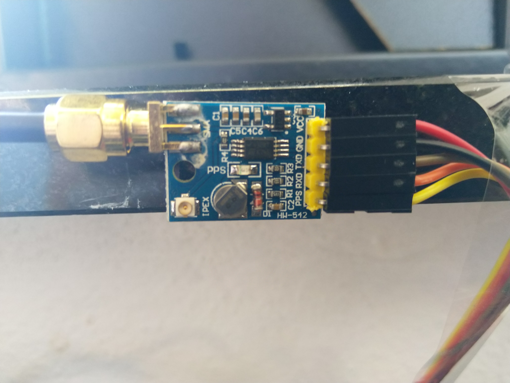

# DebFirewall
## Creates a Debian Based Firewall (Should work with Ubuntu too)

### Based on the work done by Joff Thyer of Blackhills Information Security: https://www.blackhillsinfosec.com/how-to-create-a-soho-router-using-ubuntu-linux/

Installs a complete SoHo firewall on Debian Buster or Stretch, with
 - BIND providing local name resolution.
 - ISC-DHCP-Server providing local DHCP
 - NTP resolves some of the systemd fu..ery regarding this + ensures that there's a current leapseconds file available

~~Optional~~1 components:
 - DSHIELD logging - see https://isc.sans.edu/howto.html
 - Filebeat - forwarding the logs to Elastic for local logging

 -1 Unless you ensure that the install/configure routines are not run - they run by default, modify the "main" routine accordingly.

The overall setup, hardcoded in the script is:

| Connection | IP address     | NIC    |
| ---------- | -------------- | ------ | 
| Internet   | DHCP (ISP)     | enp1s0 |
| homenet    | 192.168.10.1   | enp2s0 |
| homenet    | 192.168.20.1   | enp3s0 |                                                
| homenet    | 192.168.30.1   | enp4s0 |
| homenet    | 192.168.40.1   | wlan0  |

If you need to change this, you'll have to search and replace as required for your specific environment.

For more information, have a look at my blogpost on this: https://blog.infosecworrier.dk/2019/12/debian-based-low-power-firewall.html

Disclaimer: This worked for me on an old Atom system, a Celeron thing, and last (but not least) a PC Engines APU4C4 (https://www.pcengines.ch/apu4c4.htm) bought at https://teklager.se/en/ (great service, no affiliation). The little APU just works and uses about 6W so a great saving even compared to the Atom/Celeron boxes.

2020-06-05 added GPS and configured as Stratum-1 NTP Server - Run the install-apu-stratum.sh script when/if you've connected the GPS to J18 as described below using #3 of the Nuvoton chip (schematics for for the APU4C4 board can be found here: https://www.pcengines.ch/schema/apu4c.pdf) this ends up becoming /dev/ttyS2.
The Nuvoton was used for 2 main reasons: 1) COM1 is used for console access 2) The GPS boards are 3v.

| GPS     | J18     | J18 - Pin  | Comment                 |
| ------- | ------- | ---------- | ----------------------- | 
| VCC     | V3      |     2      |  3 Volt                 |
| GND     | Ground  |     1      |  Ground                 |
| TXD     | RXD3#   |     7      |  TX (GPS) -> RX (J18)   |                                                
| RXD     | TXD3#   |     8      |  RX (GPS) -> TX (J18)   |
| PPS     | DCD3#   |     9      |  Kernel PPS uses DCD    |

Found these little GPS receivers on e-bay, around $7, so bought quite a few (5 stratum-1 servers deployed so far)

For the APU4C4 drilled a 6.5 mm hole in the front and mounted the GPS board internally. Had to mount it in the front, as there's no room left in the back with 4 NIC's and wireless.

### I do no assume any responsibility for any outcome of running the script, so please engage brain and verify everything yourself!! ###